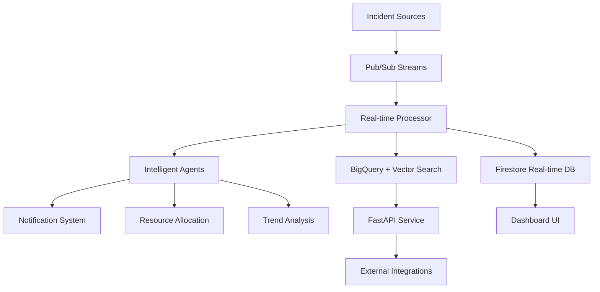

# 🌆 City Pulse - Intelligent Urban Incident Management System

[](https://opensource.org/licenses/MIT)
[](https://www.python.org/downloads/)
[](https://cloud.google.com/)
[](https://terraform.io/)

A **production-grade, AI-powered incident management system** for smart cities, specifically designed for Bengaluru. This comprehensive platform combines real-time data processing, intelligent agents, vector search, and graph analytics to enable proactive urban management and rapid incident response.

## 🏗️ System Architecture

### **Core Technologies**

- **🧠 AI/ML**: Vertex AI Gemini embeddings (3072-dim) for semantic search and analysis
- **📊 Graph Analytics**: Memgraph on GKE Autopilot (Neo4j-compatible, Cypher queries)
- **☁️ Cloud Infrastructure**: 100% Google Cloud native services
- **🔄 Real-time Processing**: Pub/Sub streaming with intelligent agent orchestration
- **🎯 Vector Search**: BigQuery ML for hybrid analytics and similarity matching

### **System Components**



## ✨ Key Features

### **🚀 Real-Time Incident Management**

- **Multi-source Data Ingestion**: Citizen reports, sensors, social media, CCTV feeds
- **Intelligent Classification**: 8 major incident categories with 32 sub-types
- **Priority Scoring**: Dynamic priority assignment based on severity, location, and impact
- **Automated Routing**: Smart assignment to appropriate departments (BBMP, Police, BESCOM, etc.)

### **🤖 Intelligent Agent System**

- **Notification Agent**: Emergency alerts and stakeholder communications
- **Trend Analysis Agent**: Pattern recognition and predictive insights
- **Resource Allocation Agent**: Optimal resource distribution and deployment
- **News Insights Agent**: Daily summaries and hot topic identification

### **🔍 Advanced Analytics**

- **Semantic Search**: Natural language querying of incident data
- **Geospatial Analysis**: Location-based filtering and radius searches
- **Temporal Patterns**: Time-series analysis and trend prediction
- **Cross-incident Correlation**: Relationship mapping between related events

### **📱 Multi-Channel Interfaces**

- **REST API**: Comprehensive endpoints for all system operations
- **Real-time Dashboard**: Live incident monitoring and management
- **Mobile-Ready**: Responsive design for field operations
- **Integration APIs**: Webhook support for external systems

## 🚀 Quick Start

### **Prerequisites**

```powershell
# Required tools
- Google Cloud Project with billing enabled
- gcloud CLI (authenticated)
- Terraform v1.0+
- Python 3.8+
- Docker & Docker Compose
```

### **1. Infrastructure Deployment**

```powershell
# Clone repository
git clone https://github.com/sharan-zinios/city-pulse.git
cd city-pulse

# Set environment variables
$env:PROJECT_ID="your-gcp-project-id"
$env:GOOGLE_APPLICATION_CREDENTIALS="path/to/service-account.json"

# Deploy infrastructure
cd infra
terraform init
terraform apply -var="project_id=$env:PROJECT_ID"
```

### **2. Local Development Setup**

```powershell
# Install dependencies
pip install -r requirements.txt

# Generate sample data
python data_gen/generate.py

# Start local services
docker-compose up -d

# Access dashboard
# Open http://localhost:3002
```

### **3. Production Deployment**

```powershell
# Deploy API service
gcloud run deploy city-pulse-api --source . --region asia-south1 --allow-unauthenticated

# Deploy streaming processor
gcloud run jobs create incident-processor --source streaming/ --region asia-south1

# Deploy intelligent agents
gcloud functions deploy agent-orchestrator --source agents/ --runtime python39
```

## � Complete Setup Guide

### **Prerequisites Installation**

#### **1. Install Required Tools**

**Google Cloud CLI:**

```powershell
# Download and install gcloud CLI from https://cloud.google.com/sdk/docs/install
# After installation, authenticate:
gcloud auth login
gcloud auth application-default login

# Set your project
gcloud config set project YOUR_PROJECT_ID
```

**Terraform:**

```powershell
# Using Chocolatey (recommended for Windows)
choco install terraform

# Or download from https://terraform.io/downloads
# Verify installation
terraform --version
```

**Python Environment:**

```powershell
# Ensure Python 3.8+ is installed
python --version

# Create virtual environment
python -m venv city-pulse-env
city-pulse-env\Scripts\activate

# Upgrade pip
python -m pip install --upgrade pip
```

**Docker & Docker Compose:**

```powershell
# Install Docker Desktop from https://docker.com/products/docker-desktop
# Verify installation
docker --version
docker-compose --version
```

#### **2. Google Cloud Project Setup**

```powershell
# Create new project (or use existing)
gcloud projects create YOUR_PROJECT_ID --name="City Pulse"

# Set billing account (required for APIs)
gcloud billing accounts list
gcloud billing projects link YOUR_PROJECT_ID --billing-account=BILLING_ACCOUNT_ID

# Enable required APIs
gcloud services enable compute.googleapis.com
gcloud services enable container.googleapis.com
gcloud services enable storage.googleapis.com
gcloud services enable bigquery.googleapis.com
gcloud services enable aiplatform.googleapis.com
gcloud services enable run.googleapis.com
gcloud services enable pubsub.googleapis.com
gcloud services enable cloudfunctions.googleapis.com
gcloud services enable firestore.googleapis.com
gcloud services enable monitoring.googleapis.com
gcloud services enable logging.googleapis.com
```

#### **3. Service Account Setup**

```powershell
# Create service account
gcloud iam service-accounts create city-pulse-sa --display-name="City Pulse Service Account"

# Grant necessary permissions
gcloud projects add-iam-policy-binding YOUR_PROJECT_ID `
  --member="serviceAccount:city-pulse-sa@YOUR_PROJECT_ID.iam.gserviceaccount.com" `
  --role="roles/editor"

gcloud projects add-iam-policy-binding YOUR_PROJECT_ID `
  --member="serviceAccount:city-pulse-sa@YOUR_PROJECT_ID.iam.gserviceaccount.com" `
  --role="roles/aiplatform.user"

# Create and download key
gcloud iam service-accounts keys create city-pulse-key.json `
  --iam-account=city-pulse-sa@YOUR_PROJECT_ID.iam.gserviceaccount.com

# Set environment variable
$env:GOOGLE_APPLICATION_CREDENTIALS="$(pwd)\city-pulse-key.json"
```

### **Local Development Setup**

#### **1. Repository Setup**

```powershell
# Clone the repository
git clone https://github.com/sharan-zinios/city-pulse.git
cd city-pulse

# Create environment file
@"
PROJECT_ID=YOUR_PROJECT_ID
GOOGLE_APPLICATION_CREDENTIALS=./city-pulse-key.json
REGION=asia-south1
"@ | Out-File -FilePath .env -Encoding UTF8
```

#### **2. Python Dependencies**

```powershell
# Activate virtual environment
city-pulse-env\Scripts\activate

# Install main dependencies
pip install -r requirements.txt

# Install development dependencies
pip install -r local_dev/requirements_local.txt

# Install API dependencies
pip install -r api/requirements.txt

# Verify installations
python -c "import google.cloud.bigquery; print('BigQuery client installed')"
python -c "import vertexai; print('Vertex AI installed')"
python -c "import fastapi; print('FastAPI installed')"
```

#### **3. Local Database Setup**

```powershell
# Generate local SQLite database for development
python local_dev/generate_db.py

# This creates:
# - incidents_data.json (sample incident data)
# - local_incidents.db (SQLite database)
# - Realistic Bengaluru incident scenarios
```

#### **4. Local Testing**

```powershell
# Run unit tests
python -m pytest local_dev/test_*.py -v

# Test database connectivity
python local_dev/test_db.py

# Test local API
python local_dev/test_local.py

# Expected output: All tests should pass
```

### **Infrastructure Deployment**

#### **1. Terraform Initialization**

```powershell
cd infra

# Initialize Terraform
terraform init

# Create terraform.tfvars file
@"
project_id = "YOUR_PROJECT_ID"
region     = "asia-south1"
zone       = "asia-south1-a"
"@ | Out-File -FilePath terraform.tfvars -Encoding UTF8

# Validate configuration
terraform validate
```

#### **2. Infrastructure Planning**

```powershell
# Review what will be created
terraform plan

# Expected resources:
# - GKE Autopilot cluster
# - BigQuery dataset and tables
# - Cloud Storage buckets
# - Pub/Sub topics and subscriptions
# - IAM roles and service accounts
# - Firestore database
# - Vertex AI resources
```

#### **3. Infrastructure Deployment**

```powershell
# Deploy infrastructure (takes 10-15 minutes)
terraform apply -auto-approve

# Verify deployment
gcloud container clusters list
gcloud storage buckets list
gcloud pubsub topics list
gcloud firestore databases list

# Get cluster credentials
gcloud container clusters get-credentials memgraph-ap --region asia-south1
```

### **Data Pipeline Setup**

#### **1. Sample Data Generation**

```powershell
# Set environment variables
$env:PROJECT_ID="YOUR_PROJECT_ID"

# Generate realistic incident data
python data_gen/generate.py

# This creates:
# - 1000+ synthetic incidents
# - Proper geographic distribution
# - Realistic incident types and severities
# - Media files in Cloud Storage
```

#### **2. Embedding Generation**

```powershell
# Generate vector embeddings
python embed/embed_and_load.py

# Process includes:
# - Text embedding using Vertex AI
# - Loading data into BigQuery
# - Creating vector search index
# - Enabling semantic search

# Verify data loading
bq query --use_legacy_sql=false "SELECT COUNT(*) FROM \`YOUR_PROJECT_ID.bengaluru_events.embeddings\`"
```

#### **3. Graph Database Setup**

```powershell
# Deploy Memgraph to GKE
kubectl apply -f memgraph_job/memgraph-deployment.yaml

# Wait for deployment
kubectl get pods -l app=memgraph

# Load data into graph
kubectl apply -f memgraph_job/job.yaml

# Verify graph loading
kubectl logs jobs/ingest-events
```

### **Application Deployment**

#### **1. API Service Deployment**

```powershell
# Build and deploy API to Cloud Run
gcloud run deploy city-pulse-api `
  --source api/ `
  --region asia-south1 `
  --allow-unauthenticated `
  --set-env-vars PROJECT_ID=$env:PROJECT_ID `
  --memory 2Gi `
  --cpu 2 `
  --min-instances 1 `
  --max-instances 100

# Get service URL
gcloud run services describe city-pulse-api --region asia-south1 --format "value(status.url)"
```

#### **2. Streaming Services Deployment**

```powershell
# Deploy real-time processor
gcloud run jobs create incident-processor `
  --image gcr.io/$env:PROJECT_ID/incident-processor `
  --region asia-south1 `
  --set-env-vars PROJECT_ID=$env:PROJECT_ID `
  --memory 4Gi `
  --cpu 2 `
  --parallelism 10 `
  --task-count 1

# Deploy intelligent agents
gcloud functions deploy agent-orchestrator `
  --source agents/ `
  --runtime python39 `
  --trigger-topic incident-stream `
  --region asia-south1 `
  --memory 1024MB `
  --timeout 540s `
  --set-env-vars PROJECT_ID=$env:PROJECT_ID
```

#### **3. Frontend Dashboard Deployment**

```powershell
# Build and deploy dashboard
cd client

# Build Docker image
docker build -t gcr.io/$env:PROJECT_ID/city-pulse-dashboard .
docker push gcr.io/$env:PROJECT_ID/city-pulse-dashboard

# Deploy to Cloud Run
gcloud run deploy city-pulse-dashboard `
  --image gcr.io/$env:PROJECT_ID/city-pulse-dashboard `
  --region asia-south1 `
  --allow-unauthenticated `
  --port 3002
```

### **Local Development Mode**

#### **1. Start Local Services**

```powershell
# Start all services using Docker Compose
docker-compose up -d

# Services started:
# - Dashboard UI (http://localhost:3002)
# - Incident Simulator (background)
# - Local database

# View logs
docker-compose logs -f
```

#### **2. Development Workflow**

```powershell
# Start API in development mode
cd api
uvicorn main:app --reload --host 0.0.0.0 --port 8000

# Start real-time simulator
cd local_dev
python realtime_simulator.py --dataset incidents_data.json

# Access services:
# - API: http://localhost:8000
# - Dashboard: http://localhost:3002
# - API Docs: http://localhost:8000/docs
```

#### **3. Testing and Validation**

```powershell
# Test API endpoints
curl -X POST "http://localhost:8000/incidents/search" `
  -H "Content-Type: application/json" `
  -d '{
    "question": "Show traffic accidents near MG Road",
    "coordinates": [12.9716, 77.5946],
    "radius_km": 5
  }'

# Test real-time features
python local_dev/quick_test.js

# Run comprehensive tests
python -m pytest local_dev/ -v --cov=api --cov-report=html
```

### **Production Monitoring Setup**

#### **1. Monitoring Configuration**

```powershell
# Create monitoring dashboard
gcloud monitoring dashboards create --config-from-file=monitoring/dashboard.json

# Set up alerting policies
gcloud alpha monitoring policies create --policy-from-file=monitoring/alerts.yaml

# Configure log-based metrics
gcloud logging metrics create incident_errors --description="API error rate" `
  --log-filter='resource.type="cloud_run_revision" AND severity>=ERROR'
```

#### **2. Health Checks**

```powershell
# Verify all services are healthy
$apiUrl = gcloud run services describe city-pulse-api --region asia-south1 --format "value(status.url)"
curl "$apiUrl/health"

# Check agent functions
gcloud functions describe agent-orchestrator --region asia-south1

# Verify data pipeline
bq query --use_legacy_sql=false "SELECT COUNT(*) as total_incidents FROM \`$env:PROJECT_ID.bengaluru_events.embeddings\` WHERE DATE(timestamp) = CURRENT_DATE()"
```

### **Environment Variables Reference**

Create a `.env` file with the following variables:

```bash
# Required
PROJECT_ID=your-gcp-project-id
GOOGLE_APPLICATION_CREDENTIALS=./path/to/service-account.json
REGION=asia-south1

# Optional - API Configuration
API_HOST=0.0.0.0
API_PORT=8000
API_WORKERS=4

# Optional - Database Configuration
BQ_DATASET=bengaluru_events
BQ_TABLE=embeddings
MEMGRAPH_URI=bolt://memgraph-service:7687

# Optional - External Integrations
TWILIO_SID=your-twilio-sid
SENDGRID_API_KEY=your-sendgrid-key
SLACK_WEBHOOK_URL=your-slack-webhook

# Optional - Development
DEBUG=true
LOG_LEVEL=INFO
ENABLE_CORS=true
```

### **Troubleshooting Common Issues**

#### **Authentication Issues**

```powershell
# Re-authenticate if needed
gcloud auth login
gcloud auth application-default login

# Verify service account permissions
gcloud projects get-iam-policy YOUR_PROJECT_ID --flatten="bindings[].members" --filter="bindings.members:serviceAccount:city-pulse-sa@YOUR_PROJECT_ID.iam.gserviceaccount.com"
```

#### **API Deployment Issues**

```powershell
# Check Cloud Run logs
gcloud run services logs read city-pulse-api --region asia-south1

# Verify environment variables
gcloud run services describe city-pulse-api --region asia-south1 --format="export"
```

#### **Data Pipeline Issues**

```powershell
# Check BigQuery table schema
bq show YOUR_PROJECT_ID:bengaluru_events.embeddings

# Verify Vertex AI model access
gcloud ai models list --region=asia-south1
```

## �📁 Project Structure

```
city-pulse/
├── 🏗️ infra/                 # Terraform infrastructure as code
│   ├── main.tf               # Core GCP resources
│   ├── variables.tf          # Configuration variables
│   └── embeddings_schema.json
├── 🔄 streaming/             # Real-time data processing
│   └── realtime_processor.py # Pub/Sub stream handler
├── 🤖 agents/               # Intelligent agent system
│   └── intelligent_agents.py # AI-powered automation
├── 🌐 api/                  # FastAPI service layer
│   ├── main.py              # REST API endpoints
│   └── requirements.txt     # Service dependencies
├── 📊 data_gen/             # Sample data generation
│   └── generate.py          # Realistic incident simulator
├── 🗄️ embed/               # ML embeddings pipeline
│   └── embed_and_load.py    # Vector embedding generation
├── 💻 client/               # Dashboard UI
│   ├── server.js            # Node.js frontend server
│   └── public/index.html    # Real-time dashboard
├── 🚢 memgraph_job/         # Graph database deployment
│   ├── job.yaml             # Kubernetes job spec
│   └── memgraph-deployment.yaml
└── 🔧 local_dev/           # Development utilities
    ├── realtime_simulator.py
    ├── generate_db.py
    └── test_*.py            # Testing utilities
```

## 🛠️ Implementation Guide

### **Phase 1: Infrastructure Setup**

**1. Deploy Core Infrastructure**

```powershell
# Navigate to infrastructure directory
cd infra

# Initialize Terraform
terraform init

# Review planned changes
terraform plan -var="project_id=$env:PROJECT_ID"

# Deploy infrastructure
terraform apply -var="project_id=$env:PROJECT_ID"
```

**Infrastructure Components:**

- **GKE Autopilot Cluster**: Scalable Memgraph deployment
- **BigQuery Dataset**: Data lake with vector search capabilities
- **Cloud Storage**: Media and backup storage
- **Pub/Sub Topics**: Real-time message streaming
- **Firestore**: Live dashboard data
- **Cloud Run**: Serverless API hosting

### **Phase 2: Data Pipeline Setup**

**1. Generate Sample Data**

```powershell
# Set environment variables
$env:PROJECT_ID="your-project-id"

# Generate realistic Bengaluru incident data
python data_gen/generate.py

# Output: Creates 1000+ incidents with proper categorization
# - 8 major incident types (traffic, power, water, construction, etc.)
# - Geographic distribution across Bengaluru wards
# - Realistic severity levels and department assignments
```

**2. Process Embeddings**

```powershell
# Generate vector embeddings using Vertex AI
python embed/embed_and_load.py

# This process:
# - Creates 3072-dimensional embeddings for text descriptions
# - Loads data into BigQuery with vector search index
# - Enables semantic search capabilities
```

### **Phase 3: Graph Database Deployment**

**1. Deploy Memgraph on GKE**

```powershell
# Connect to GKE cluster
gcloud container clusters get-credentials memgraph-ap --region asia-south1

# Deploy Memgraph
kubectl apply -f memgraph_job/memgraph-deployment.yaml

# Load incident data into graph
kubectl apply -f memgraph_job/job.yaml
```

**Graph Schema:**

```cypher
// Incident nodes with relationships
(incident:Incident)-[:LOCATED_AT]->(location:Location)
(incident:Incident)-[:ASSIGNED_TO]->(department:Department)
(incident:Incident)-[:REPORTED_BY]->(source:Source)
(location:Location)-[:IN_WARD]->(ward:Ward)
(incident:Incident)-[:RELATED_TO]->(incident:Incident)
```

### **Phase 4: API Deployment**

**1. Deploy FastAPI Service**

```powershell
# Deploy to Cloud Run
gcloud run deploy city-pulse-api `
  --source api/ `
  --region asia-south1 `
  --allow-unauthenticated `
  --set-env-vars PROJECT_ID=$env:PROJECT_ID

# Service provides:
# - RESTful incident search and analysis
# - Vector similarity search
# - Graph-based relationship queries
# - Real-time incident streaming
```

### **Phase 5: Real-time Processing**

**1. Deploy Streaming Components**

```powershell
# Deploy real-time processor
gcloud run jobs create incident-processor `
  --source streaming/ `
  --region asia-south1 `
  --set-env-vars PROJECT_ID=$env:PROJECT_ID

# Deploy intelligent agents
gcloud functions deploy agent-orchestrator `
  --source agents/ `
  --runtime python39 `
  --trigger-topic incident-stream
```

## 🔌 API Reference

### **Core Endpoints**

#### **Incident Search**

```http
POST /incidents/search
Content-Type: application/json

{
  "question": "Show me traffic accidents near Electronic City",
  "coordinates": [12.8456, 77.6603],
  "radius_km": 5,
  "event_types": ["traffic_accident"],
  "time_range_hours": 24
}
```

**Response:**

```json
{
  "query": "Show me traffic accidents near Electronic City",
  "location": { "lat": 12.8456, "lon": 77.6603, "radius_km": 5 },
  "results_count": 12,
  "incidents": [
    {
      "id": "inc_001",
      "event_type": "traffic_accident",
      "sub_category": "minor_collision",
      "description": "Two-wheeler collision at traffic signal",
      "location_name": "Electronic City Phase 1",
      "severity_level": "medium",
      "priority_score": 6.8,
      "coordinates": [12.8445, 77.6589],
      "timestamp": "2025-01-27T14:30:00Z",
      "assigned_department": "Traffic_Police",
      "event_status": "in_progress"
    }
  ]
}
```

#### **AI-Powered Analysis**

```http
POST /incidents/analyze
Content-Type: application/json

{
  "question": "What's the trend for power outages this month?",
  "coordinates": [12.9716, 77.5946],
  "radius_km": 10,
  "analysis_type": "trend_prediction"
}
```

#### **Real-time Incident Reporting**

```http
POST /incidents/report
Content-Type: application/json

{
  "event_type": "pothole",
  "description": "Large pothole causing traffic disruption",
  "coordinates": [12.9352, 77.6245],
  "severity_level": "high",
  "source": "citizen_report",
  "media_urls": ["gs://bucket/image1.jpg"],
  "reporter_contact": "+91XXXXXXXXXX"
}
```

### **Graph Query Endpoints**

#### **Relationship Analysis**

```http
GET /graph/relationships?incident_id=inc_001&depth=2
```

#### **Hotspot Identification**

```http
GET /graph/hotspots?event_type=traffic_accident&time_window=7d
```

## 🤖 Intelligent Agents

### **Agent Architecture**

Each agent is designed as an autonomous service that processes specific tasks triggered by incident events or scheduled operations.

#### **1. Notification Agent**

- **Purpose**: Stakeholder communication and emergency alerts
- **Triggers**: High-priority incidents (score ≥ 8.0)
- **Actions**: SMS, email, app notifications, department alerts
- **Integration**: Twilio, SendGrid, Slack

#### **2. Trend Analysis Agent**

- **Purpose**: Pattern recognition and predictive insights
- **Triggers**: Daily/weekly scheduled runs or incident clusters
- **Actions**: Trend reports, anomaly detection, forecast generation
- **ML Models**: Time-series analysis, clustering algorithms

#### **3. Resource Allocation Agent**

- **Purpose**: Optimal resource distribution and deployment
- **Triggers**: Multiple concurrent incidents or resource requests
- **Actions**: Personnel assignment, equipment allocation, route optimization
- **Algorithms**: Constraint optimization, graph algorithms

#### **4. News Insights Agent**

- **Purpose**: Public communication and transparency
- **Triggers**: End-of-day processing or significant events
- **Actions**: Summary generation, hot topic identification, report compilation
- **Output**: Daily briefs, weekly reports, public dashboards

## 🔍 Advanced Analytics

### **Vector Search Capabilities**

```python
# Semantic incident search
def search_similar_incidents(query_text, coordinates, radius_km=5):
    embedding = model.get_embeddings([query_text])[0].values

    sql = f"""
    SELECT id, description, similarity_score
    FROM `{project}.bengaluru_events.embeddings`
    WHERE ST_DISTANCE(
        ST_GEOGPOINT(coordinates[OFFSET(1)], coordinates[OFFSET(0)]),
        ST_GEOGPOINT({coordinates[1]}, {coordinates[0]})
    ) <= {radius_km} * 1000
    ORDER BY COSINE_DISTANCE(embedding, {embedding}) ASC
    LIMIT 20
    """
    return list(bq.query(sql).result())
```

### **Graph Analytics**

```cypher
// Find incident clusters in specific area
MATCH (i:Incident)-[:LOCATED_AT]->(l:Location)
WHERE l.ward_number = 150
  AND i.timestamp > datetime() - duration('P7D')
WITH l, count(i) as incident_count
WHERE incident_count > 5
RETURN l.name, incident_count
ORDER BY incident_count DESC

// Identify recurring incident patterns
MATCH (i1:Incident)-[:LOCATED_AT]->(l:Location)<-[:LOCATED_AT]-(i2:Incident)
WHERE i1.event_type = i2.event_type
  AND abs(duration.between(i1.timestamp, i2.timestamp).days) <= 7
RETURN l.name, i1.event_type, count(*) as pattern_frequency
ORDER BY pattern_frequency DESC
```

## 📊 Monitoring & Observability

### **System Health Monitoring**

- **Cloud Monitoring**: Infrastructure metrics and alerting
- **Application Performance**: API response times and error rates
- **Data Pipeline**: Processing delays and failure rates
- **Agent Performance**: Task completion rates and processing times

### **Business Metrics**

- **Incident Resolution Time**: Average time from report to resolution
- **Department Efficiency**: Performance metrics by assigned department
- **Geographic Hotspots**: Areas with highest incident density
- **Trend Analysis**: Month-over-month incident pattern changes

### **Custom Dashboards**

```python
# Example monitoring query
def get_system_health_metrics():
    metrics = {
        "incidents_per_hour": get_incident_rate(),
        "avg_response_time": get_avg_response_time(),
        "agent_success_rate": get_agent_success_rate(),
        "storage_usage": get_storage_metrics(),
        "api_uptime": get_api_uptime()
    }
    return metrics
```

## 🚦 Performance Optimization

### **Cost Management**

- **BigQuery**: Partitioned tables by date, clustered by location
- **Cloud Storage**: Lifecycle policies for media cleanup
- **Compute**: Auto-scaling based on demand patterns
- **Vector Search**: Optimized embedding dimensions (768 vs 3072)

### **Scaling Strategies**

```terraform
# Auto-scaling configuration
resource "google_cloud_run_v2_service" "api" {
  template {
    scaling {
      min_instance_count = 1
      max_instance_count = 100
    }

    containers {
      resources {
        limits = {
          cpu    = "2"
          memory = "4Gi"
        }
      }
    }
  }
}
```

### **Performance Benchmarks**

- **API Response Time**: < 200ms for search queries
- **Vector Search**: < 500ms for similarity searches
- **Real-time Processing**: < 5s incident-to-notification latency
- **Graph Queries**: < 1s for relationship analysis

## 🔐 Security & Compliance

### **Data Protection**

- **Encryption**: Data encrypted at rest and in transit
- **Access Control**: IAM-based service authentication
- **API Security**: Rate limiting and request validation
- **Audit Logging**: Complete activity tracking

### **Privacy Considerations**

- **Data Anonymization**: PII scrubbing for public datasets
- **Retention Policies**: Automated data lifecycle management
- **Consent Management**: User permission tracking
- **GDPR Compliance**: Right to deletion implementation

## 🤝 Contributing

### **Development Setup**

```powershell
# Fork and clone repository
git clone https://github.com/your-username/city-pulse.git
cd city-pulse

# Create virtual environment
python -m venv venv
venv\Scripts\activate

# Install development dependencies
pip install -r requirements.txt
pip install -r local_dev/requirements_local.txt

# Run tests
python -m pytest local_dev/test_*.py
```

### **Code Standards**

- **Python**: PEP 8 compliance, type hints required
- **Documentation**: Comprehensive docstrings and comments
- **Testing**: Minimum 80% code coverage
- **Git**: Conventional commit messages

### **Contribution Guidelines**

1. Fork the repository
2. Create feature branch (`git checkout -b feature/amazing-feature`)
3. Commit changes (`git commit -m 'Add amazing feature'`)
4. Push to branch (`git push origin feature/amazing-feature`)
5. Open Pull Request

## 📄 License

This project is licensed under the MIT License - see the [LICENSE](LICENSE) file for details.

## 🙏 Acknowledgments

- **Google Cloud Platform** for comprehensive infrastructure services
- **Memgraph** for high-performance graph database capabilities
- **Vertex AI** for advanced ML and embedding models
- **FastAPI** for modern, fast web API framework
- **Open Source Community** for various tools and libraries used

## 📞 Support

- **Documentation**: [docs.city-pulse.dev](https://docs.city-pulse.dev)
- **Issues**: [GitHub Issues](https://github.com/sharan-zinios/city-pulse/issues)
- **Discussions**: [GitHub Discussions](https://github.com/sharan-zinios/city-pulse/discussions)
- **Email**: support@city-pulse.dev

---

**Built with ❤️ for smarter cities and better urban management**
